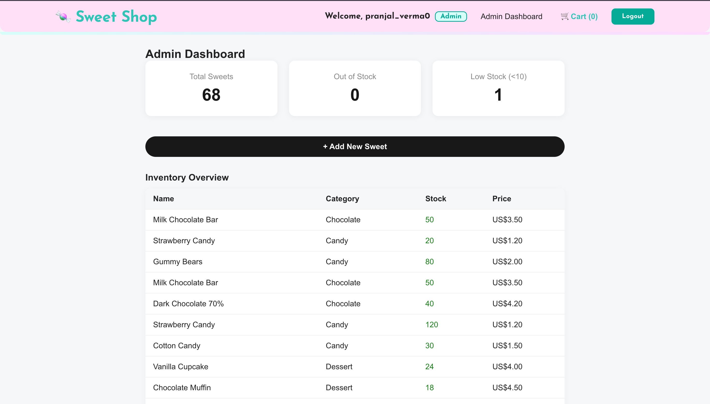
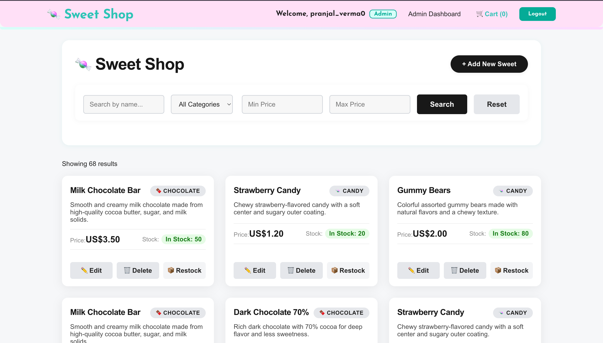
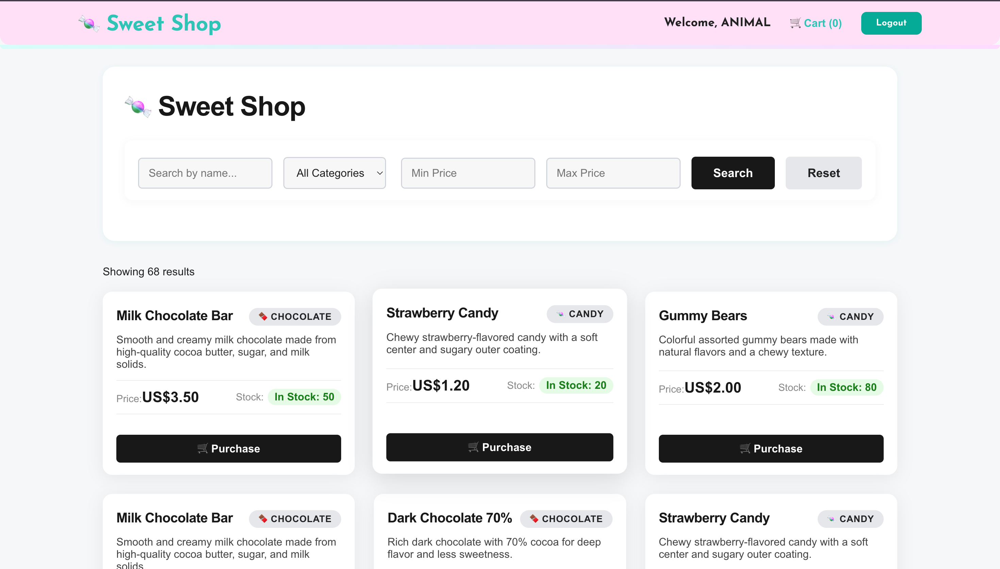

# Sweet Shop Application

[Live Demo](https://kata-incubyte-frontend.onrender.com/login) &nbsp;|&nbsp; [GitHub Repository](https://github.com/pran-ekaiva006/kata-Incubyte)

## Demo Screenshots

### Admin View
The following screenshots show the admin dashboard and inventory management features:

**Admin Dashboard**


**Inventory Overview**


**Admin Credentials:**
- Email: `new@gmail.com`
- Password: `123456789`

### Buyer View
The following screenshot shows the buyer's view of the Sweet Shop:



---
Replace the image paths above with the actual paths if you save the screenshots in a different location.

---
# 🍬 Sweet Shop Management System

A full-stack web application for managing a sweet shop, built with **Test-Driven Development (TDD)** methodology. This project demonstrates modern development practices including RESTful API design, authentication, authorization, and comprehensive testing.

## 🎯 Project Overview

The Sweet Shop Management System allows users to:
- Browse available sweets
- Search and filter sweets by name, category, and price
- Purchase sweets (authenticated users)
- Manage inventory - add, update, delete sweets (admin only)
- Restock sweets (admin only)

## 🚀 Tech Stack

### Backend
- **Node.js** with **Express.js** - RESTful API
- **MongoDB** with **Mongoose** - Database
- **JWT** - Authentication
- **bcryptjs** - Password hashing
- **Jest** & **Supertest** - Testing framework

### Frontend
- **React** - UI framework
- **React Router** - Client-side routing
- **Axios** - HTTP client
- **CSS3** - Styling

## 📋 Prerequisites

Before running this project, make sure you have:

- **Node.js** (v18 or higher)
- **MongoDB** (v6 or higher) - running locally or MongoDB Atlas account
- **npm** or **yarn** package manager
- **Git**

## 🛠️ Installation & Setup

### 1. Clone the Repository

```bash
git clone https://github.com/pran-ekaiva006/kata-Incubyte.git
cd kata-Incubyte
```

### 2. Backend Setup

```bash
# Navigate to backend directory
cd backend

# Install dependencies
npm install

# Create .env file
cat > .env << EOF
NODE_ENV=development
PORT=5000
MONGODB_URI=mongodb://localhost:27017/sweet-shop
JWT_SECRET=your-super-secret-jwt-key-change-this-in-production
JWT_EXPIRE=7d
EOF

# Start MongoDB (if running locally)
# On macOS with Homebrew:
brew services start mongodb-community

# Run tests
npm test

# Start development server
npm run dev
```

The backend server will run on **http://localhost:5000**

### 3. Frontend Setup

```bash
# Navigate to frontend directory (from project root)
cd frontend

# Install dependencies
npm install

# Start development server
npm start
```

The frontend application will run on **http://localhost:3000**

## 🧪 Running Tests

### Backend Tests

```bash
cd backend

# Run all tests with coverage
npm test

# Run tests in watch mode
npm run test:watch

# Run specific test file
npm test -- user.model.test.js
```

### Test Coverage

The backend has comprehensive test coverage:
- **49 tests** passing
- **86.66%** code coverage
- Tests cover: Models, Controllers, Routes, Middleware, Authentication

## 📡 API Endpoints

### Authentication Endpoints

| Method | Endpoint | Access | Description |
|--------|----------|--------|-------------|
| POST | `/api/auth/register` | Public | Register new user |
| POST | `/api/auth/login` | Public | Login user |

### Sweet Management Endpoints

| Method | Endpoint | Access | Description |
|--------|----------|--------|-------------|
| GET | `/api/sweets` | Public | Get all sweets |
| GET | `/api/sweets/search` | Public | Search sweets |
| POST | `/api/sweets` | Admin | Create new sweet |
| PUT | `/api/sweets/:id` | Admin | Update sweet |
| DELETE | `/api/sweets/:id` | Admin | Delete sweet |
| POST | `/api/sweets/:id/purchase` | Private | Purchase sweet |
| POST | `/api/sweets/:id/restock` | Admin | Restock sweet |

### API Examples

#### Register User
```bash
curl -X POST http://localhost:5000/api/auth/register \
  -H "Content-Type: application/json" \
  -d '{
    "name": "John Doe",
    "email": "john@example.com",
    "password": "password123"
  }'
```

#### Login
```bash
curl -X POST http://localhost:5000/api/auth/login \
  -H "Content-Type: application/json" \
  -d '{
    "email": "john@example.com",
    "password": "password123"
  }'
```

#### Get All Sweets
```bash
curl http://localhost:5000/api/sweets
```

#### Search Sweets
```bash
# By name
curl http://localhost:5000/api/sweets/search?name=chocolate

# By category
curl http://localhost:5000/api/sweets/search?category=Chocolate

# By price range
curl http://localhost:5000/api/sweets/search?minPrice=2&maxPrice=5
```

#### Create Sweet (Admin Only)
```bash
curl -X POST http://localhost:5000/api/sweets \
  -H "Content-Type: application/json" \
  -H "Authorization: Bearer YOUR_JWT_TOKEN" \
  -d '{
    "name": "Milk Chocolate Bar",
    "category": "Chocolate",
    "price": 2.99,
    "quantity": 100,
    "description": "Delicious milk chocolate"
  }'
```

#### Purchase Sweet
```bash
curl -X POST http://localhost:5000/api/sweets/SWEET_ID/purchase \
  -H "Content-Type: application/json" \
  -H "Authorization: Bearer YOUR_JWT_TOKEN" \
  -d '{"quantity": 5}'
```

## 🎨 Frontend Features

- **User Authentication** - Login/Register forms with validation
- **Sweet Dashboard** - Display all available sweets
- **Search & Filter** - Find sweets by name, category, price range
- **Purchase System** - Buy sweets with quantity validation
- **Admin Panel** - Manage inventory (add, edit, delete sweets)
- **Responsive Design** - Mobile-friendly interface

## 🔐 User Roles

### Regular User
- View all sweets
- Search and filter sweets
- Purchase sweets (requires authentication)

### Admin User
- All regular user permissions
- Create new sweets
- Update sweet details
- Delete sweets
- Restock inventory

**Note:** To create an admin user, manually set `role: 'admin'` in the database or modify the registration endpoint for testing.

## 🤖 My AI Usage

As required by the assessment guidelines, here is a detailed account of AI tool usage in this project:

### AI Tools Used

1. **GitHub Copilot** - Primary AI assistant
2. **ChatGPT (GPT-4)** - Architecture planning and problem-solving

### How AI Was Used

#### 1. **Project Planning & Architecture** (10% AI, 90% Manual)
- **AI Used For:** Brainstorming API endpoint structures and discussing REST best practices
- **Manual Work:** Final architecture decisions, database schema design, and project structure
- **Example:** Asked AI about JWT vs Session-based authentication pros/cons for this use case

#### 2. **Boilerplate Code Generation** (30% AI, 70% Manual)
- **AI Used For:** Generating initial Express.js setup, Mongoose schema templates
- **Manual Work:** Customizing schemas, adding validation rules, implementing business logic
- **Example:** AI generated basic Express app structure, I manually added CORS, error handling, and route organization

#### 3. **Test Writing** (40% AI, 60% Manual)
- **AI Used For:** Suggesting test cases, generating test structure templates
- **Manual Work:** Writing specific test scenarios, edge cases, and assertions
- **Example:** AI suggested common test patterns for authentication, I wrote custom tests for sweet purchase logic with inventory constraints

#### 4. **Implementation Code** (25% AI, 75% Manual)
- **AI Used For:** Auto-completing function implementations, suggesting error handling patterns
- **Manual Work:** Core business logic, async/await flow, database queries, authorization logic
- **Example:** AI auto-completed bcrypt hashing setup, I implemented the password comparison method and JWT generation logic

#### 5. **Debugging** (50% AI, 50% Manual)
- **AI Used For:** Identifying common errors, suggesting fixes for Jest/ESM configuration issues
- **Manual Work:** Understanding root causes, testing fixes, validating solutions
- **Example:** AI helped resolve Jest ES modules compatibility issue by suggesting `NODE_OPTIONS=--experimental-vm-modules`

#### 6. **Documentation** (60% AI, 40% Manual)
- **AI Used For:** Generating initial README structure, API documentation format
- **Manual Work:** Adding project-specific details, setup instructions, customizing content
- **Example:** AI generated API endpoint table template, I filled in actual endpoints and added examples

#### 7. **Code Comments** (20% AI, 80% Manual)
- **AI Used For:** JSDoc comment templates
- **Manual Work:** Writing meaningful comments explaining business logic and edge cases

### AI Impact on My Workflow

#### Positive Impacts:
- ⚡ **Speed:** Reduced boilerplate writing time by ~40%
- 🎯 **Focus:** Allowed me to focus on business logic rather than syntax
- 📚 **Learning:** Discovered new patterns and best practices through AI suggestions
- 🐛 **Debugging:** Faster identification of common errors and configuration issues

#### Challenges:
- ⚠️ **Over-reliance Risk:** Had to be careful not to accept AI suggestions blindly
- 🔍 **Code Review:** Needed to thoroughly review AI-generated code for correctness
- 🧪 **Test Quality:** AI-suggested tests sometimes missed edge cases requiring manual addition
- 📖 **Understanding:** Ensured I understood every line of AI-generated code before using it

### Specific Examples of AI Assistance

1. **Jest Configuration for ES Modules**
   - **Problem:** Jest couldn't parse ES6 import statements
   - **AI Suggestion:** Use `NODE_OPTIONS=--experimental-vm-modules`
   - **My Addition:** Created proper jest.config.js with testTimeout and coverage settings

2. **Mongoose Schema Validation**
   - **AI Generated:** Basic schema structure with types
   - **I Added:** Custom validators, enum values for categories, pre-save hooks for password hashing

3. **Authentication Middleware**
   - **AI Suggested:** Basic JWT verification pattern
   - **I Implemented:** Full authorization middleware with role-based access control

4. **Test Structure**
   - **AI Provided:** Basic describe/it structure
   - **I Created:** Comprehensive test suites with beforeAll/afterAll hooks, proper cleanup, and 49 test cases

### Reflection

Using AI tools in this project was immensely beneficial, but required discipline:

- **I learned** to use AI as a coding assistant, not a replacement for critical thinking
- **I ensured** all TDD principles were followed - tests written before implementation
- **I validated** every AI suggestion by running tests and understanding the code
- **I took ownership** of the final implementation and can explain every design decision

The key was maintaining a balance: leveraging AI for productivity while ensuring deep understanding of the codebase.


```

## 📝 Future Enhancements

- [ ] Add order history tracking
- [ ] Implement shopping cart functionality
- [ ] Add payment integration
- [ ] Email notifications for low stock
- [ ] Sweet recommendations based on purchase history
- [ ] Image upload for sweets
- [ ] Admin dashboard with analytics
- [ ] Export inventory reports

## 🤝 Contributing

This is an assessment project, but feedback is welcome! Feel free to open issues or suggest improvements.

## 📄 License

This project is for educational/assessment purposes.

## 👤 Author

**Pranjal Kumar Verma**
- GitHub: [@pran-ekaiva006](https://github.com/pran-ekaiva006)
- Email: pranjalverma975@gmail.com

## 🙏 Acknowledgments

- **Incubyte** for the challenge
- **GitHub Copilot** for AI-assisted development
- **MongoDB** for database documentation
- **Express.js** community for excellent resources

---


**Assessment Date:** December 2025